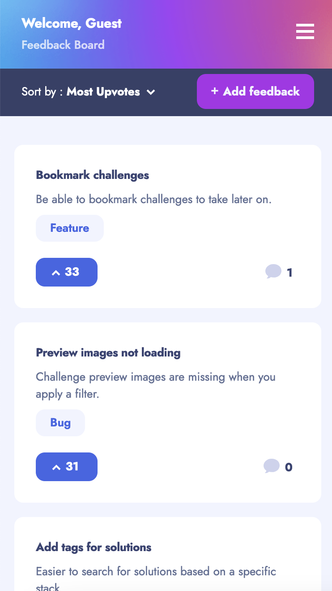
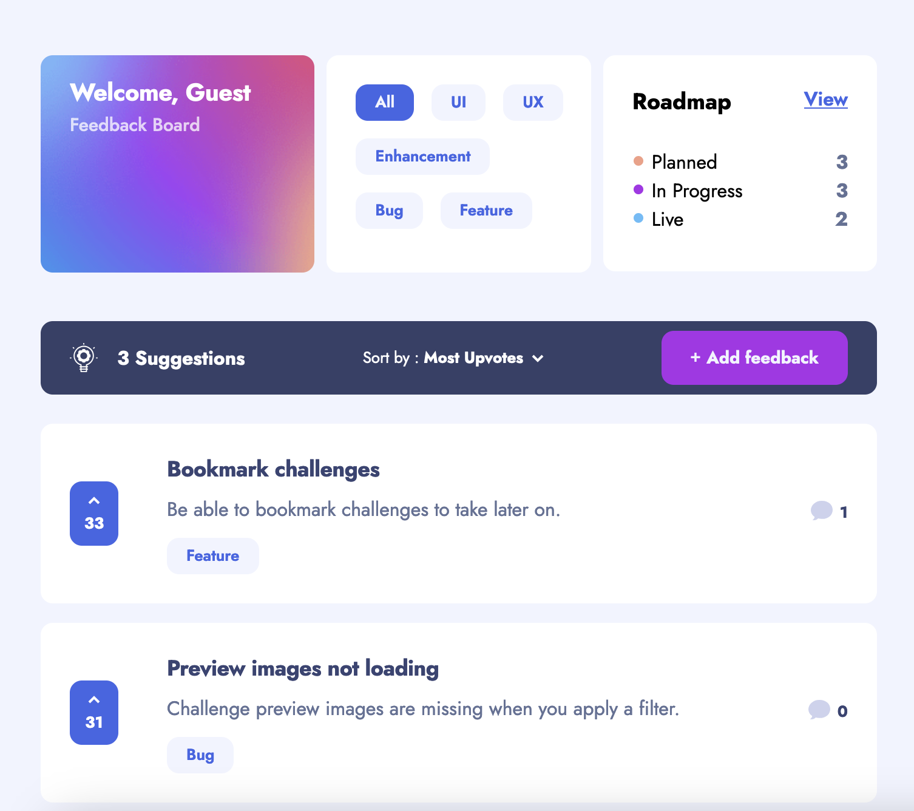
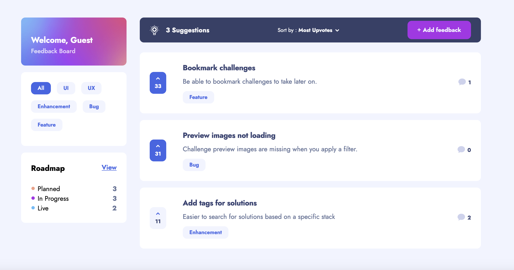

# Frontend Mentor - Product feedback app solution

## Welcome! 👋

This is a full stack solution (MERN) to the [Product feedback app challenge on Frontend Mentor](https://www.frontendmentor.io/challenges/product-feedback-app-wbvUYqjR6).

## Table of contents

- [Overview](#overview)
  - [The challenge](#the-challenge)
  - [Screenshot](#screenshot)
  - [Links](#links)
- [My process](#my-process)
  - [Built with](#built-with)
  - [What I learned](#what-i-learned)
  - [Continued development](#continued-development)
  - [Useful resources](#useful-resources)
- [Author](#author)

## Overview

### The challenge

Users should be able to:

- [x] View the optimal layout for the app depending on their device's screen size
- [x] See hover states for all interactive elements on the page
- [x] Create, read, update, and delete product feedback requests
- [x] Receive form validations when trying to create/edit feedback requests
- [x] Sort suggestions by most/least upvotes and most/least comments
- [x] Filter suggestions by category
- [x] Add comments to a product feedback request
- [] Reply to a comment on a product feedback request
- [x] Upvote product feedback requests on all pages
- [x] **Bonus**: Keep track of any changes, even after refreshing the browser

### Screenshot

| Mobile (375px)                                 |  Tablet (768px)                                  | Desktop (1440px)                                 |
| ---------------------------------------------- | ------------------------------------------------ | ------------------------------------------------ |
|  |  |  |

### Links

- Live Site URL: [Feedback App](https://jovial-klepon-dc8a53.netlify.app/)

## My process

### Built with

- Mobile-first workflow
- React.js
- Styled Components
- Express.js
- Node.js
- MongoDB
- Mongoose
- React Hook Form
- Redux Toolkit
- RTK Query

### Continued development

 At the moment a user create, read, update and delete suggestions and can sort through the list of feedback items on the suggestions homepage. Currently the only user on the application is the default "Guest/@GuestUser" to demonstrate how the application functions. As development continues, users will be able to create accounts under different names to upvote feedbacks and leave comments on feedback items. The roadmap page also shows an organized list of feedback suggestions that have a status of "Planned", "In-Progress", or "Live".

## Author

- Website - [Portfolio](https://www.aniyaallen.com/)
- Frontend Mentor - [@amallen1](https://www.frontendmentor.io/profile/amallen1)
